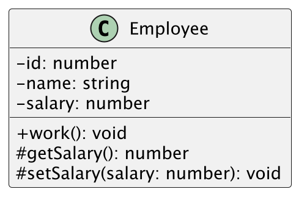
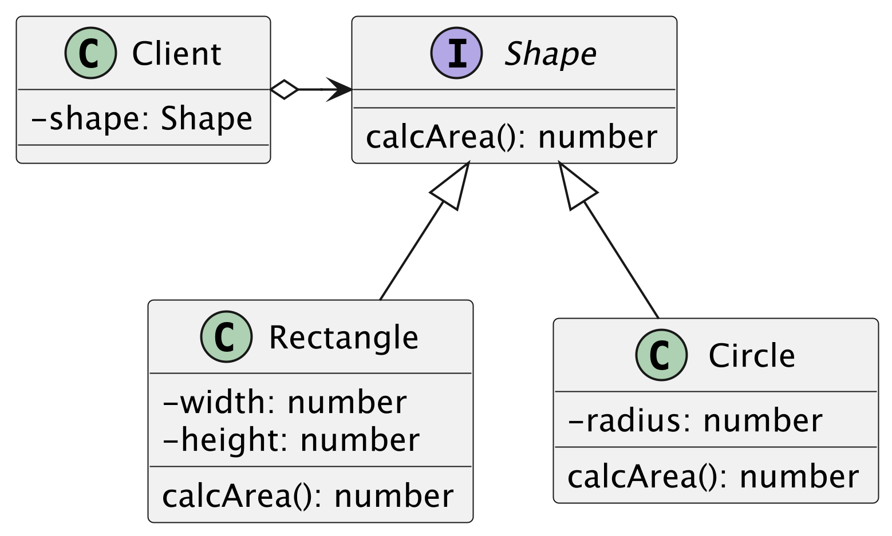

## 演習1
次のクラス図をTypeScriptで実装してください

メソッドの仕様
- workメソッドは"働きます"とログ出力します
- getSalaryメソッドはフィールドのsalaryを返却します
- setSalaryメソッドは引数のsarlaryをフィールドのsalaryに代入します

## 演習2
次のクラスをTypeScriptで実装してください

メソッドの仕様
- Rectangleの面積はwidthとheightの掛け算で算出します
- Circleの面積はradius * radius * Math.PIで算出します

